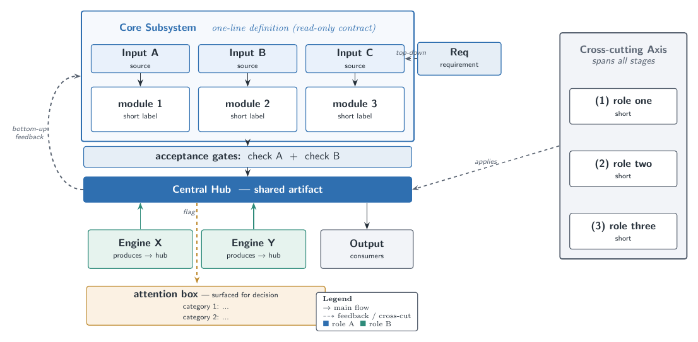

# tikz-figure

A Claude Code skill: draw a **single publication-quality methodology / architecture /
pipeline figure** with **TikZ + LaTeX** (the kind in a paper's "method overview"). Produces
a vector **PDF** (drop into a paper), a **PNG** (embed in docs), and an editable **`.tex`**
source. Reach for it when a Mermaid or PowerPoint draft looks cluttered, flat, or "not like
a real paper figure".

## Install

```bash
mkdir -p ~/.claude/skills/tikz-figure
curl -sL https://github.com/fbdeme/tikz-figure/archive/main.tar.gz \
  | tar xz -C ~/.claude/skills/tikz-figure --strip-components=1
```

## Use

Invoke `/tikz-figure`, or just ask for a *"paper figure / 방법론 그림 / architecture diagram"*.
The skill (v2 — pipeline: **Spec → Draft → Render → Review loop → Ship**):

1. **Preflight** — checks `pdflatex` + `pdftoppm`.
2. **Spec** — 5-line figure spec first: message, hero, flow direction, groups, and the
   manuscript source-of-truth (labels are quotes, not paraphrases).
3. **Start from `assets/template.tex`** — palette, node styles, a `fit` container, a hub bar,
   a side rail, a feedback curve, and a legend (compiles as-is).
4. **Apply the venue style vocabulary** — shape/arrow/color semantics, typography, and
   composition rules distilled from NeurIPS-2025 accepted figures
   ([`references/style_guide.md`](references/style_guide.md),
   [`references/palettes.md`](references/palettes.md)).
5. **Build & review loop** — `pdflatex` → `pdftoppm` → **score the PNG** on a 5-dimension
   venue rubric with veto rules ([`references/design_review.md`](references/design_review.md));
   iterate until ≥ 8.5/10 (paper) or 4 passes.
6. **Ship** — `.tex` + `.pdf` + `.png`, embedded with a caption that links the source.

For *illustrative/conceptual* raster figures the skill can escalate to a locally installed
[PaperBanana](https://github.com/fbdeme/PaperBanana) pipeline (see SKILL.md §7).

## Requirements

- TeX Live with TikZ (`texlive-latex-extra`) and `poppler-utils` (`pdftoppm`).
- **English labels recommended** — papers are in English, and it avoids CJK-in-LaTeX pain
  (`kotex`/`luatexja` are often missing). Put any localized prose in the doc caption.

## What it looks like

The bundled template (`assets/template.tex`) renders a generic skeleton you adapt:



See [`SKILL.md`](SKILL.md) for the full workflow, design principles, and pitfalls.

## License

MIT
